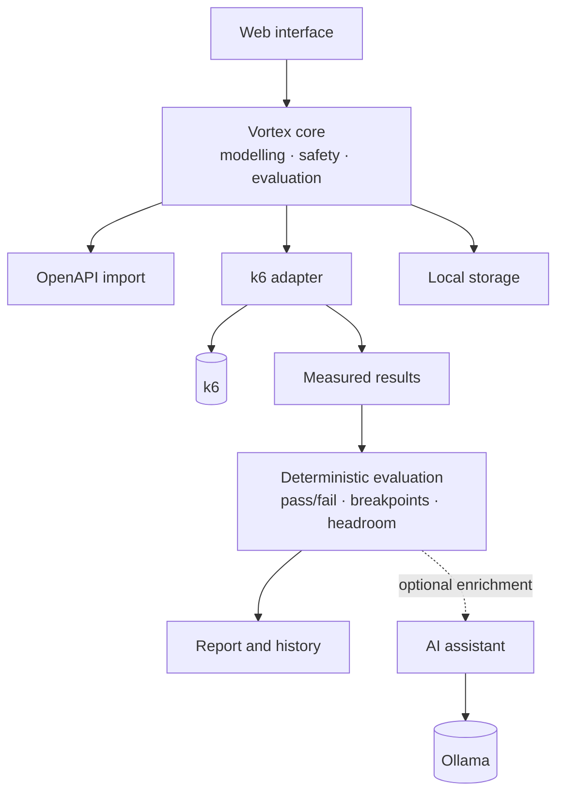

# Vortex

**Vortex helps engineering teams turn vague performance requirements into repeatable,
production-informed capacity evidence.**

You own a microservice. You know roughly how much traffic it receives. You have no performance
tests, limited experience writing them, and a nagging suspicion that "it's probably fine" is not an
answer anyone should accept.

Vortex is the path from there to a result you can defend:

```
What traffic do we actually need to support?
        ↓
What workload represents that traffic?
        ↓
Can the service handle it?
        ↓
Where does it stop meeting its objectives?
        ↓
What ran out first?
        ↓
How much headroom do we have?
        ↓
What should we investigate next?
```

---

## What Vortex is not

**It is not a load-testing engine.** [k6](https://k6.io) generates the traffic, and it is excellent
at it. Vortex does not reimplement virtual users, arrival-rate scheduling, HTTP load generation or
distributed execution, and it never will.

The problem Vortex solves is not the absence of load-generation technology. It is that teams do not
know where to start, what workload to model, how much traffic to generate, what kind of test to run,
what thresholds to set, how to read the output, where the bottleneck was, or how to compare last
week's numbers with this week's.

> **Adopt the ecosystem. Own the engineering workflow.**

Vortex is also not an observability platform, an APM product, a Kubernetes platform, a chatbot, a
traffic recorder, or a guarantee of production capacity. See
[docs/01-product/overview.adoc](docs/01-product/overview.adoc#scope-and-non-goals) for the full list and the reasoning.

---

## How it works



Everything above the dotted line is deterministic. The same measurements always produce the same
verdict, on any machine, whether or not a language model is installed.

---

## Running it

You need **Java 25** and **k6**. Everything else is optional.

```bash
git clone <this-repository> && cd vortex
./mvnw clean verify
```

Start the bundled sample service, which has a deliberate, documented bottleneck so a stress test
shows something real:

```bash
./mvnw -pl vortex-demo-service spring-boot:run
```

Then start Vortex and open it in a browser:

```bash
./mvnw -pl vortex-app spring-boot:run
```

Vortex listens on <http://127.0.0.1:7717> — the loopback address only. It generates traffic on your
behalf and has no authentication, so exposing it to a network is a deliberate decision, not a
default. See [docs/02-architecture/security.adoc](docs/02-architecture/security.adoc).

Not sure whether your machine is ready? The top bar shows what Vortex can currently do — Java, the
load generator, the workspace, Docker and a local model, each with its own state and its own remedy.
Anything optional that is missing gets that treatment: what you lose, and what to do about it.

---

## The model, in five words

```text
Service  →  Workload  →  Evaluation  →  Run  →  Evidence
```

| | |
|---|---|
| **Service** | The system under test. Vortex measures one at a time. |
| **Operation** | One interaction with it — one request. Operations compose a workload; they are not tests in their own right. |
| **Workload** | A traffic condition applied to the whole service: how much load, split across which operations, held for how long. Reusable, and lives in version control. |
| **Evaluation** | The performance question a run answers — can it hold its peak, where does it stop meeting its objectives. |
| **Run** | One execution, kept whole with the workload it actually applied. |
| **Evidence** | What happened, with the conditions it was measured under attached. |

---

## The five-minute tour

1. **Add your service.**
2. **Import its OpenAPI document.** Vortex parses it deterministically — paths, methods,
   parameters, schemas. No guessing, no model involved.
3. **Say what each request needs.** A header that never changes, an idempotency key that must never
   repeat, an account id that has to exist, a token that must not be written down. You pick the
   source — fixed, generated, a column of a CSV you added, or an environment variable — and Vortex
   works out how to supply it. Where the API description already knows the shape of a value, it
   offers that as a suggestion and says why.
4. **Define a workload.** One operation is enough to start: "can `POST /orders` sustain 50
   submissions a second within its latency objective?" is a complete performance question. Add more
   operations when you want to reproduce the traffic the service actually receives — a mixture
   arriving concurrently from many callers, not one caller working through a script.

   One total rate, split across those operations by weight. Vortex divides the total; it never runs
   each operation at the full rate, and the editor shows you the split as you type. Choose an
   arrival rate when the caller does not slow down because you did, or a fixed concurrency when it
   genuinely is a bounded pool.
5. **Set objectives.** p95 latency, p99 latency, error rate.
6. **Ask a performance question.** Not "which workload do you want to run" — *what do you want to
   understand about this service?* Vortex works out which workload answers it. If exactly one does,
   it uses that one and tells you why. If several do, it asks, because they measure different
   things. If none does, it offers to build one.
7. **Check the preflight.** Plain English, the exact target, the environment class, how the traffic
   divides across your operations, and what has to be true to pass. Nothing has been sent anywhere
   yet.
8. **Run it.** Live progress, then evidence that opens by answering the question you asked — and,
   where the workload held more than one level, a picture of the range it tested with the boundary
   marked only if the run actually established one.
9. **Optionally, ask for an interpretation.** A local model explains what the measurements might
   mean. It cannot change any of them.

---

## What makes the results trustworthy

**A total is divided, never repeated.** A 60/30/10 mix at 100 requests/sec runs at 60, 30 and 10 —
not three workloads at 100 each. The domain model makes the wrong reading impossible to express: a
per-operation rate can only be produced by dividing a total.

**Arrival rate and concurrency are never conflated.** "50 requests/sec" and "50 VUs" are the same
number and different facts — fifty virtual users against a 100 ms operation produce roughly 500
requests/sec, and against a 2 s operation roughly 25. Every level carries its unit, no conversion
between them exists, and comparing a run of each at the same number reports *not comparable* rather
than a percentage. The ambiguous label "TPS" does not appear in the product.

**Aggregate latency is never the whole story.** A run can pass overall while one operation is failing
badly — usually the low-volume one, whose latency barely moves the average. Every result carries a
per-operation breakdown, and objectives can be scoped to a single operation.

**Environment class travels with every number.** A run against simulated dependencies cannot
establish production capacity, however fast it was, and Vortex says so beside the figure rather than
in a footnote.

**Unevaluated is not the same as passed.** If a measurement an objective needed was not collected,
the objective is reported as unevaluated. An objective that was never checked has not been met.

**Limits are reported at the confidence they deserve.** The SLO breakpoint — where your objectives
were first violated — is deterministic. Whether the *system* itself broke is contextual and noisy,
so Vortex reports a bounded range backed by several independent signals, or says "not established
by this test". That is frequently the correct answer.

**Capacity is always conditional.** Tested capacity is recorded with the version, environment,
dependency mode, workload model, operation mix, objectives and duration that produced it.
"212 requests/sec" detached from those conditions is a rumour, not evidence.

**What the requests carried is one of those conditions.** A figure from replaying one account id ten
thousand times and one from a dataset of ten thousand distinct accounts are different results. Every
run records where each value came from — a dataset and column, a generator, an environment reference
— and never the values themselves. A generated value differs on every request by design, and a
secret exists only inside the load generator's process.

**Two runs are only compared when they tested the same experiment.** A regression verdict requires
that the workload, stage shape, operation mix, objectives, environment, dependency mode and target
all match — and Vortex names the one that changed when they do not, rather than producing a
percentage. The release under test is deliberately *not* part of that: two runs of one experiment
against different builds are the comparison, not an incomparable pair. See
[experiment identity](docs/02-architecture/execution-and-evidence.adoc#experiment-identity).

**The test definition is portable.** What to test is written to `.vortex/vortex.yaml` in your
service's repository. Commit it, review it in a pull request, and point Vortex at the checkout —
it adopts the existing file without modifying it. That includes the human review that gates
mutating operations: an approval visible in a pull request is stronger evidence than a click in
somebody's browser.

A dataset can travel with it too, if you say so: an uploaded file stays on your machine by default,
and committing it alongside the service is a separate action that names the exact file it will write
first. A configuration that depends on a local dataset says so on a machine that does not have it,
rather than guessing.

One thing does not yet travel in that file: the imported API description itself. So a machine that
has never seen the service needs the specification imported once before a workload can resolve.
Making the catalog reference committable is [on the roadmap](docs/01-product/roadmap.adoc); until then,
Vortex says which operations it could not resolve rather than guessing.

---

## AI, and its limits

A local model — via [Ollama](https://ollama.com) — acts as a performance engineering assistant. It
explains workload proposals and interprets results.

It is never asked to invent a workload. Operations come from the API description deterministically,
and how much traffic each one receives is a fact about production that a model cannot know.

**It never determines performance truth.** Measurements, threshold verdicts, breakpoints, headroom
and regression deltas are computed by ordinary code. The model receives figures Vortex has
*already* calculated and adds interpretation on top.

Concretely: given an observed peak of 120 requests/sec and a 1.5× forecast policy, Vortex calculates
180 and applies its documented rounding rule. The assistant explains that this gives roughly 1.5×
headroom over observed traffic. It is never asked to do the multiplication — a number that might
come out differently on a second attempt has no place in capacity planning.

Every AI finding must cite evidence by identifier, and Vortex resolves those identifiers against
the measurements that actually exist. A claim about CPU in a run where CPU was never measured is
discarded before anyone sees it, and the gap is reported as missing telemetry instead.

**Vortex is fully usable with no model at all.** Onboarding, configuration, execution, threshold
evaluation, breakpoints, history, comparison and reports all work without one. AI is enrichment,
never the critical path.

---

## Documentation

The full documentation set lives under [docs/](docs/index.adoc), starting from its index. The most
useful entry points:

| | |
|---|---|
| [Product overview](docs/01-product/overview.adoc) | What Vortex is for, why it exists, its principles, scope and vocabulary |
| [Roadmap](docs/01-product/roadmap.adoc) | Where it is going |
| [Interpreting a Vortex result](docs/03-performance-model/interpreting-results.adoc) | How to interpret what you get |
| [Workloads](docs/03-performance-model/workloads.adoc) | Arrival rate vs concurrency, and composition vs sequence |
| [Configuration reference](docs/04-reference/configuration.adoc) | Every key in `vortex.yaml` |
| [Architecture](docs/02-architecture/architecture.adoc) | How it is built |
| [Execution and evidence](docs/02-architecture/execution-and-evidence.adoc) | The lifecycle, the evidence model, and experiment identity |
| [The interface](docs/02-architecture/interface.adoc) | The repeated ideas that make Vortex recognisable |
| [Security](docs/02-architecture/security.adoc) | Threat model and safeguards |
| [Decisions](docs/adr/index.adoc) | Why it is built that way |
| [Contributing](CONTRIBUTING.md) | Building, testing, extending |

---

## Status

Vortex is at **0.1.0** — a working MVP, not a finished product. The vertical slice described above
works end to end against a real service with real k6. What is present is built properly; what is
absent is
[documented as absent](docs/01-product/roadmap.adoc) rather than stubbed out.

Notably **not yet done**: distributed execution through the k6 Operator, observability integrations
beyond a service's own metrics endpoint, and scheduled runs. The abstractions those will sit behind
exist and are exercised by real implementations, but the implementations themselves are future work.

The web interface is the only supported way to run Vortex today — a scriptable/headless entry point
and CI integration are an explicitly optional future capability, not a maintained second interface;
see [the roadmap](docs/01-product/roadmap.adoc).

Native compilation is configured but **has not been verified on any machine** — see
[docs/02-architecture/architecture.adoc](docs/02-architecture/architecture.adoc#native-image) for exactly what remains.
