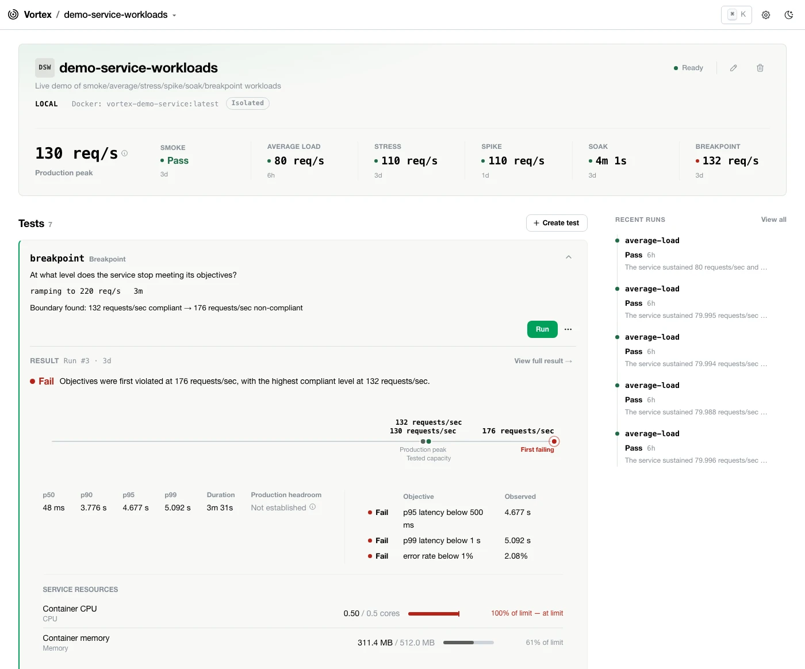
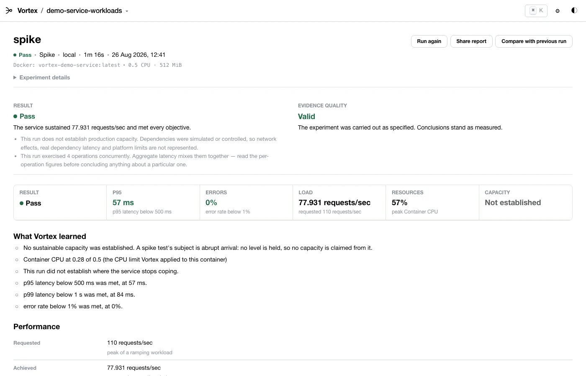

# Vortex

## Know your numbers. Before you pay to prove them.

**Vortex is a local-first performance engineering workbench.** Point it at your service's OpenAPI spec, describe the traffic you're worried about, and it turns that into a real k6 workload, runs it on your machine, and hands back evidence — not terminal noise.

[Getting started](docs/01-product/getting-started.adoc) · [Documentation](docs/index.adoc) · [Roadmap](docs/01-product/roadmap.adoc)

---

## The problem Vortex solves

Running a load test isn't hard. **k6 already does that extremely well.**

The hard part is everything else: What traffic your service actually receives. What "normal" vs "peak" actually look like. Whether 50 req/s or 5,000 is the number worth testing. If your service failed or your load generator did.

Most teams answer this by jumping between an observability dashboard, API specs, terminal output, and their own memory of how it all fits together. The honest answer that survives that process is often: *"probably enough."*

**That's not evidence. That's a shrug with a chart.**

Vortex turns that chain from fragmented guessing into one coherent workflow.

---

## What Vortex does

✓ **Start from your actual API.** Parse your OpenAPI spec deterministically — paths, methods, parameters, schemas — instead of hand-rolling boilerplate.

✓ **Model production-realistic traffic.** Weighted operation mixes, distinct arrival rate and concurrency, optional calibration from real Prometheus or Dynatrace data.

✓ **Run locally, safely.** Real k6 execution with a preflight showing exactly what you're about to send, and a typed confirmation before hitting any non-local target.

✓ **Get a verdict, not metrics.** Deterministic pass/fail against your latency and error objectives. Which resource ran out first. Whether the run was even valid.

✓ **Keep evidence, not memory.** Execution history, capacity trends, and comparisons that only run when two tests actually measured the same thing.

✓ **Ask a local model to interpret (never decide).** Optional Ollama-backed assistant explains findings Vortex computed. It cannot invent numbers.

---

## Why "local first" matters

Vortex runs on your machine, against your service, *before* you provision expensive test infrastructure. That's not a limitation to tolerate — it's the entire point.

A laptop isn't production. Simulated dependencies aren't real. Vortex will never claim a local run proves you'll handle Black Friday. Every capacity figure stays tied to the conditions it was measured under.

What it *will* do is **replace guessing with evidence before you spend money proving it**: whether your service behaves under load, roughly where it struggles, what's likely to break first, whether this build regressed. That's a far better input to an expensive environment test than a number you picked because it sounded round.

---

## What Vortex is not

- **Not another load generator.** k6 generates traffic. Vortex doesn't reimplement that; it never will.
- **Not an APM.** Prometheus and Dynatrace stay your observability platform. Vortex consumes their data as evidence.
- **Not a production-capacity oracle.** When your question genuinely needs a production-scale environment, that's still where you go.

[See full scope and non-goals →](docs/01-product/overview.adoc#scope-and-non-goals)

---

## What you get from a run

A completed run answers these in one place:

- Did the objectives hold?
- What throughput or concurrency was actually achieved?
- Where did objectives stop holding?
- Which resource approached its limit first?
- Was the run itself valid — or did the load generator saturate first?
- How much headroom does this establish?
- Is this comparable to a previous run?

Every claim is computed by deterministic code, never a language model. Capacity figures are never detached from the conditions that produced them. [Learn what every number means →](docs/03-performance-model/interpreting-results.adoc)

---

## Documentation

| | |
|---|---|
| [Getting started](docs/01-product/getting-started.adoc) | Five-minute tour of the workflow |
| [Product overview](docs/01-product/overview.adoc) | Why Vortex exists, principles, vocabulary |
| [Understanding results](docs/03-performance-model/interpreting-results.adoc) | Every number on a result page, explained |
| [Configuration reference](docs/04-reference/configuration.adoc) | Every key in `vortex.yaml` |
| [Architecture](docs/02-architecture/architecture.adoc) | How it's built |
| [Roadmap](docs/01-product/roadmap.adoc) | What's next |
| [Contributing](CONTRIBUTING.md) | Building and extending |

Full docs — including ADRs — are under [docs/](docs/index.adoc).

---

## Status

**Early alpha.** The core workflow — import, model, run, evaluate, compare — works end to end with real k6 and real services. Production-informed calibration against Prometheus and Dynatrace is working. Configuration, APIs, and UX are still expected to change.

See [the roadmap](docs/01-product/roadmap.adoc) for details.

---

## Contributing

See [CONTRIBUTING.md](CONTRIBUTING.md).

## Acknowledgements

Built around [k6](https://k6.io) and optionally [Ollama](https://ollama.com). See [THIRD_PARTY_NOTICES.md](THIRD_PARTY_NOTICES.md) for the full dependency and license list.

## License

Apache License 2.0 — see [LICENSE](LICENSE).
